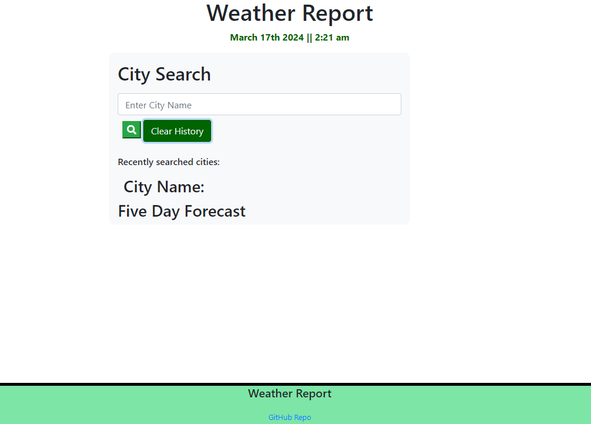
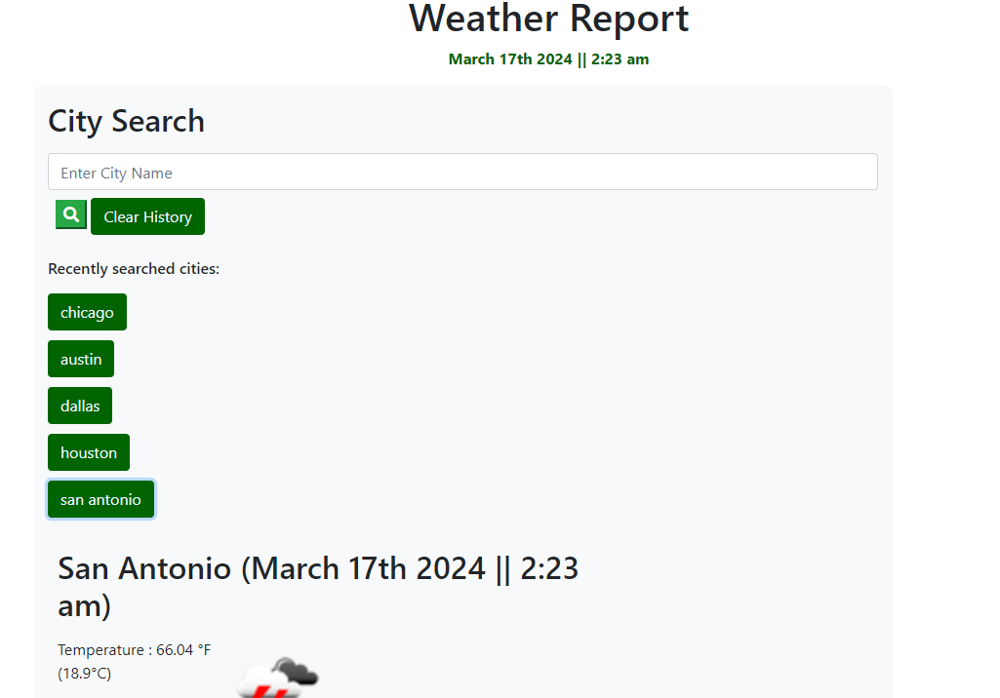
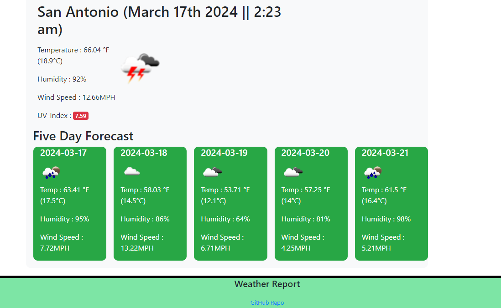

# weather-report
Five day forecast of the weather
## Description:
Application using HTML, CSS, and JavaScript. Main use for the application is to learn more about coding by using this weather forecast application. There is a main header section with a descriptive title and shows the current date/time. Below the header, there is an input box for cities. There is a button to search and a button to clear the history. Underneath, there is the weather display. At the very bottom, there is a link to the GitHub Repo.
## Instructions:
To search for a city, type the desired name of the city into the search bar and click the green magnifying glass icon. Your cities will be saved to local storage for future use. After you search for a city, you can click on one of the recent search cities to go back and look at those as well. Good luck!

## Application URL:
https://brackenluke.github.io/weather-report/
## GitHub URL:
https://github.com/brackenluke/weather-report
## Screenshots:
Main Page Screenshot: 

Recently Searched Screenshot: 

Five Day Forecast Screenshot: 

